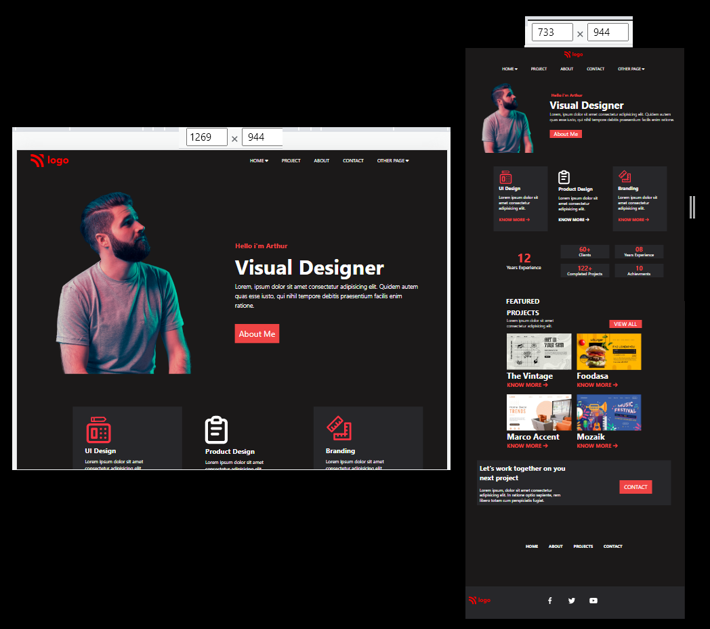

# Project 15 : Product Design Landing Page

- Click here for live demo of the Project on [ NETLIFY ](https://parikshit-tailwind-15.netlify.app/ "Parikshit Project 15")

 

###  This Project is build using HTML & TAILWIND CSS  

<b> Note: </b>  
- This Project is Mobile Responisive. 

- In our Project the Media Query Targets  the particular viewport range.

    

  

- Tailwind is Highly Customizable but i have not used those properties  till now  because i was facing some issues regarding the proper Configuration of Tailwind during this Project,
we will get a deeper dive into the concepts of Customization in Tailwind CSS in coming Projects.

- As i am getting better and better at it,I will Keep Updating the Code to make this Project better.

***

 

 

>Knowledge gained :

 

<b>How i Started :</b>

1. Tailwind is very easy to use and to get your grasp on if you have good knowledge about CSS.

2. [ Tailwind's documentation ](https://tailwindcss.com/docs/installation) has got one of the best explanations for the same, that is its core concepts, how it works, and its usage.

<b>Difficulties I faced :</b>

- The problem I faced was since we were styling our code inside our HTML file (classes to be precised), the code started looking very confusing especially when you have to heavily style our elements.

***

###<b>Time Taken To Complete This Project : 8 hours </b> 

***

 

>The project is a part of the learning from  [ Sir Hitesh Choudhary's ](https://github.com/hiteshchoudhary) course on FULL STACK JAVASCRIPT WEB DEVELOPER. The idea credit is his. I have understood the concepts and learned them by building this on my own with a bare minimum reference of source code (only when my efforts couldn't clear the roadblock). The way of execution is modified as per my viewpoint whenever is necessary.

